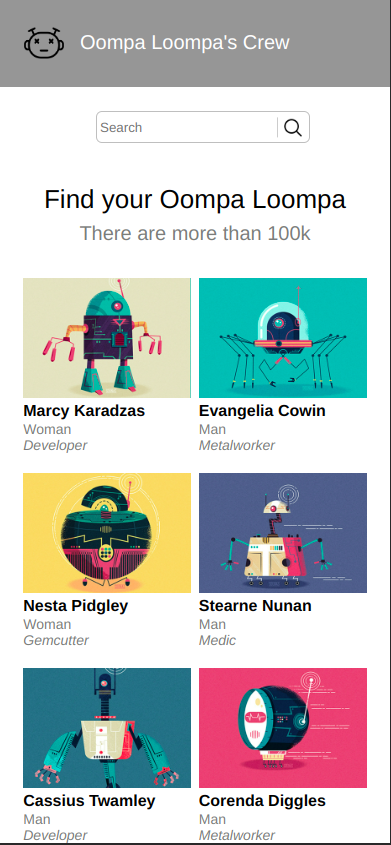

# React + TypeScript + Vite

This template provides a minimal setup to get React working in Vite with HMR and some ESLint rules.

## Getting Started

To run the project locally using Docker, follow these steps:

1. Make sure you have Docker and Docker Compose installed on your machine.
2. Clone this repository to your local machine.
3. Navigate to the project directory in the terminal.
4. Run the following command to build and start the application:

```js
docker-compose up
```

To run the project locally without docker, follow these steps:

1. Make sure you have Node version >= 18.
2. Clone this repository to your local machine.
3. Navigate to the project directory in the terminal.
4. Run the following command to build and start the application:

```js
npm install
```

```js
npm run dev
```

This will spin up the necessary containers and launch the application. Open your web browser and visit http://localhost:3000 to access the application.

Sreenshots:




